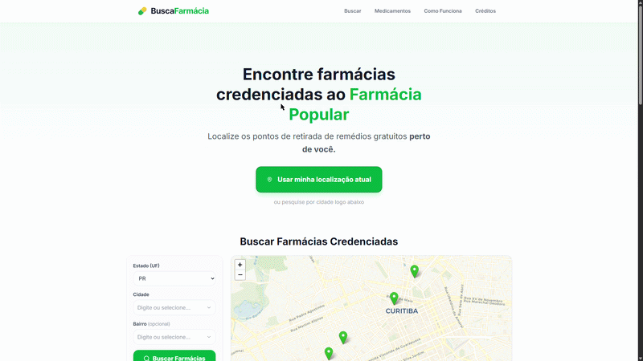

# Busca Farmácia Popular 💊🗺️

> O programa Farmácia Popular já tem um mecanismo de busca — mas ele é ruim. Filtrar por estado, cidade e bairro funciona, mas não é intuitivo, não tem geolocalização e não resolve a pergunta mais básica do usuário: *qual farmácia credenciada está perto de mim agora?* Esse projeto reconstrói essa experiência do zero.

**[🌐 Acessar o projeto →](https://www.buscafarmaciapopular.com.br)**


<div align="center">
  
</div>

---

## 🔎 O Problema

O portal oficial disponibiliza os dados como uma planilha estática. O mecanismo de busca existente filtra por estado, cidade e bairro, mas sem coordenadas geográficas ou geolocalização do usuário — localizar a farmácia mais próxima exige navegação manual por uma lista sem contexto espacial.

---

## ✅ O que o sistema oferece

- 📍 **Geolocalização por GPS** — encontra farmácias credenciadas próximas da posição atual do usuário, sem precisar do nome do bairro.
- 🗺️ **Navegação integrada** — ao selecionar uma farmácia, abre a rota diretamente no Google Maps.
- 🔍 **Filtros manuais** — busca por Estado, Município e Bairro para quem prefere pesquisar sem compartilhar localização.
- 💊 **Busca por nome comercial** — sistema de pesquisa que aceita tanto o nome de referência quanto o princípio ativo do medicamento.
- 📋 **Orientações sobre retirada** — informações acessíveis sobre documentos necessários, regras de dispensação, Fraldas Geriátricas e Dignidade Menstrual.

---

## 🔩 Pipeline de Dados

A base oficial fornece apenas endereços em texto — sem coordenadas. Para viabilizar o mapa com **28.552 farmácias**, construí um pipeline local em Python com três etapas:

**1. Extração e limpeza**

Download automatizado da planilha oficial do Ministério da Saúde via HTTP, com detecção dinâmica do cabeçalho real (o arquivo contém linhas institucionais antes dos dados).

Os endereços da base chegam sem padronização: mesma rua grafada de formas diferentes, complementos misturados ao logradouro, registros sem número. O pipeline normaliza via regex antes de qualquer chamada à API:

```python
# 20+ abreviações mapeadas para o formato que a API interpreta corretamente
ABREVIACOES = {
    r'\bAVE\b\.?': 'AVENIDA',
    r'\bCEL\b\.?': 'CORONEL',
    r'\bPRA\b\.?': 'PRACA',
    r'\bTRAV\b\.?': 'TRAVESSA',
    # ...
}

# Complementos removidos antes da geocodificação
TOKENS_REMOVER = (
    r'\bSN\b', r'\bS/?N°?\b',       # sem número
    r'\bSALA\s+\w+',                 # sala
    r'\bBLOCO\s+\w+', r'\bBL\s+\w+',# bloco
    r'\bCAIXA POSTAL\b.*',           # caixa postal
    # ...
)
```

**2. Geocodificação**

Conversão de cada endereço textual em coordenadas via Google Maps Geocoding API.

Para lidar com os limites de requisição da API, o pipeline implementa *retry* exponencial para chamadas com falha (`2s → 4s → 8s`). Além disso, possui um filtro rígido que só aceita resultados com as duas classificações mais altas de precisão da API:

- `ROOFTOP` — O Google localizou o imóvel com precisão e fixou a coordenada diretamente sobre ele.
- `RANGE_INTERPOLATED` — O Google confirmou a rua e a quadra, mas estima a posição com base na sequência numérica dos imóveis da rua (margem de erro de poucos metros).

Qualquer resultado abaixo disso (`GEOMETRIC_CENTER`, `APPROXIMATE`) é descartado — não aparece no mapa.

**3. Resultado**

| Métrica | Valor |
|---|---|
| Total de farmácias na base | 28.552 |
| Geocodificadas com precisão | 23.483 |
| Aproveitamento | **82,2%** |
| Erros de API | 0 |

Os 17,8% restantes foram descartados por imprecisão ou ausência de endereço utilizável nos dados do governo — não por falha do pipeline.

---

## 🛠 Stack

| Camada | Tecnologia |
|---|---|
| Frontend | React + TypeScript (Vite) |
| Mapas | Leaflet / React Leaflet |
| UI | Tailwind CSS + Radix UI (shadcn/ui) |
| Banco de dados | Supabase (PostgreSQL + PostGIS + RLS) |
| ETL | Python (pandas, requests, python-dotenv) |
| Deploy | Vercel + domínio próprio |

---

## 🗂 Estrutura do repositório

```
busca-farmacia-popular/
├── etl/
│   ├── parse_farmacias.py        # Extração e limpeza da planilha oficial
│   ├── geocode_google.py         # Geocodificação via Google Maps API
│   └── upload_supabase.py        # Carga dos dados no Supabase
├── data/
│   ├── farmacias_clean.csv       # gerado pelo parse_farmacias.py (não versionado)
│   └── farmacias_geocoded.csv    # gerado pelo geocode_google.py (não versionado)
├── frontend/
│   └── Farmacia-Acessivel/
│       └── artifacts/
│           └── busca-farmacia/   # Aplicação React
├── docs/                         # Documentação e assets
└── .env.example                  # Variáveis de ambiente necessárias
```

---

## 🚀 Rodando localmente

```bash
git clone https://github.com/LucasAlejandroTerres/busca-farmacia-popular.git
cd frontend/Farmacia-Acessivel/artifacts/busca-farmacia
npm install
# Crie um .env baseado no .env.example com suas credenciais do Supabase
npm run dev
```

Para rodar o ETL do zero:

```bash
pip install pandas requests python-dotenv openpyxl
# Configure GOOGLE_GEOCODING_API_KEY e SUPABASE_SECRET_KEY no .env
python etl/parse_farmacias.py
python etl/geocode_google.py
python etl/upload_supabase.py
```

---

## 👤 Autor

**Lucas Alejandro Terres**

[](https://www.linkedin.com/in/lucasalejandroterres) [](https://github.com/LucasAlejandroTerres)

Projeto independente. Dados baseados na lista oficial de farmácias credenciadas publicada pelo [Ministério da Saúde](https://www.gov.br/saude/pt-br/composicao/sectics/farmacia-popular).
